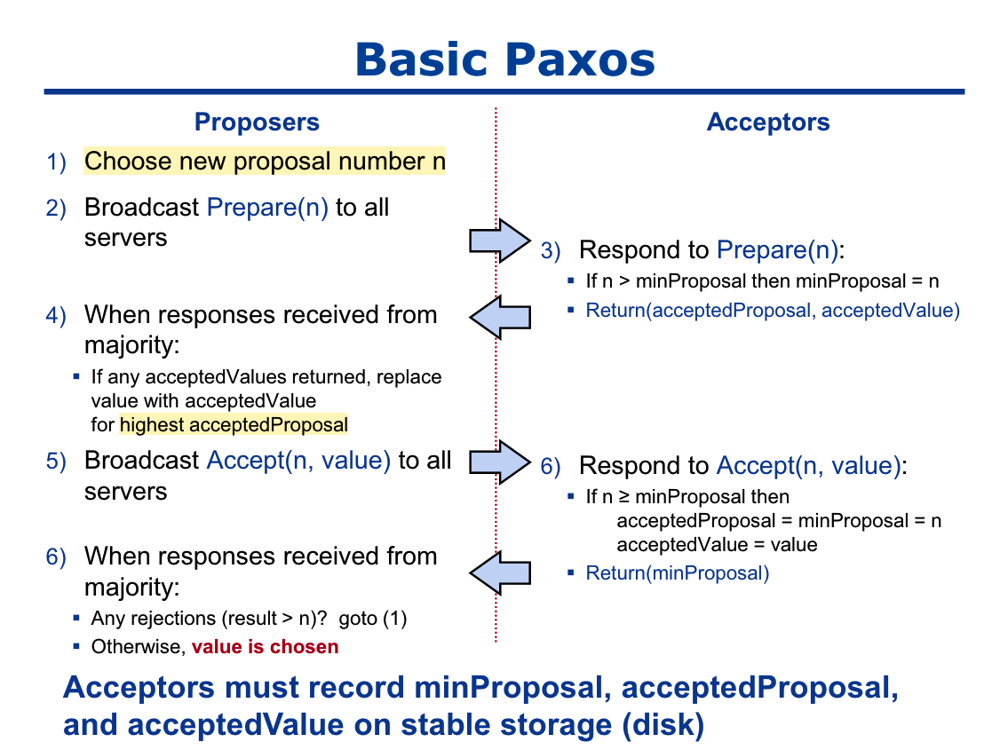

# 个人学习笔记

## raft理论知识

### 名词解释
- leader：raft中的一种角色，负责处理客户端请求，并将请求复制给其他的follower
- candidate：raft中的一种角色，候选人
- follower：raft中的一种角色，主要职责包括：投票、复制日志。
- log entry：一个log entry包含了指令、 term号、index（位置）
- term：raft将时间划分为多个term，每个term最多只有一个leader，每个term有一个id


### 角色以及角色之间的转换
raft有三种角色：
- leader
- candidate
- follower

follower->candidate : 长时间没有收到leader的心跳
candidate->leader: 收到一半以上的投票
candidate/leader->follower: response中term id比自己的高

### 选主

1）follower->candidate : 长时间没有收到leader的心跳
2）candidate->leader: 收到一半以上的投票

### 处理客户端请求

1）leader 收到客户端请求后，保存到日志中
2）leader 将日志复制给follower
3）如果一多半复制成功，则回复客户端


----------------

## basic paxos理论知识

### Paxos Components
- Proposers：处理客户端请求，发出提案，决定是否chose
- Acceptors：决定是否接受提案，保存chosen的提案

### 流程



1. Proposer 选择一个提案号 n
2. Proposer 准备 prepare消息发送给所有的Acceptors
3. Acceptor 检查提案号 n, 如果比自己本地的大，则接受提案，Response会携带 acceptedPropposal 和 acceptedValue 。
4. Proposer 准备 accept消息
5. Proposer 发送 accept消息给所有的Acceptors
6. Acceptor 检查提案号 n, 如果大于等于自己本地的，更新本地的{acceptedPropposal 和 acceptedValue}
7. Proposer 如果收到拒绝就返回到1继续，没有则发送commit消息

### multi-paxos
1. 使用basic paxos选一个Proposer作为leader
2. 后续有leader 发起 accept消息（日志复制）
3. Acceptor 检查accept消息（日志复制）
4. leader发送commit消息


----------------


## 选举流程
client端：没有找到

server端：
```
RaftServiceImpl::request_vote //  对应raft.proto
 NodeImpl::handle_request_vote_request

```


## 日志复制流程
server端：
```
RaftServiceImpl::append_entries
 NodeImpl::handle_append_entries_request
  LogManager::append_entries
```


## add_peer流程

client端：
```cpp
cli.cpp/add_peer
 构造AddPeerRequest
 stub.add_peer // CliService_Stub应该是由cli.proto文件生成的
```

server端：
```cpp
CliServiceImpl::add_peer
 NodeImpl::add_peer
  unsafe_register_conf_change
   NodeImpl::ConfigurationCtx::start
    // 一个一个peer添加
    ReplicatorGroup::add_replicator
     Replicator::start
```

## snapshot流程
```
RaftServiceImpl::install_snapshot
 NodeImpl::handle_install_snapshot_request
  SnapshotExecutor::install_snapshot
```


## 疑惑
- pre_vote 是做什么的？
